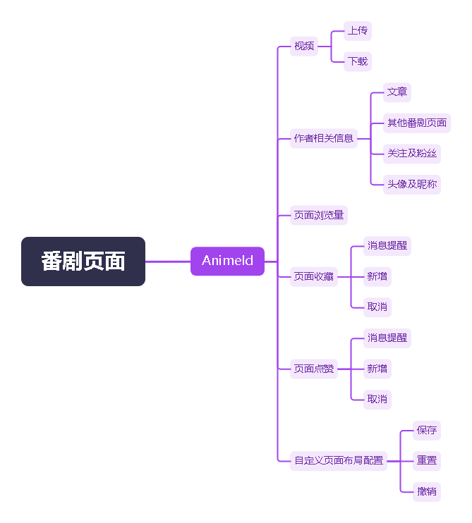
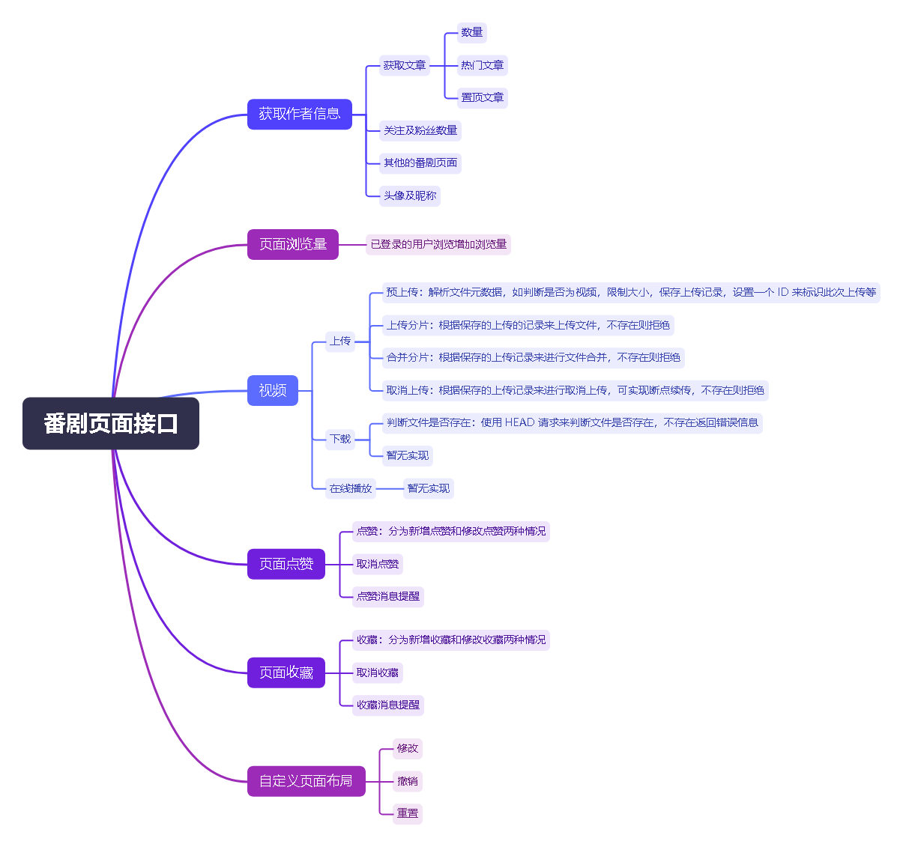
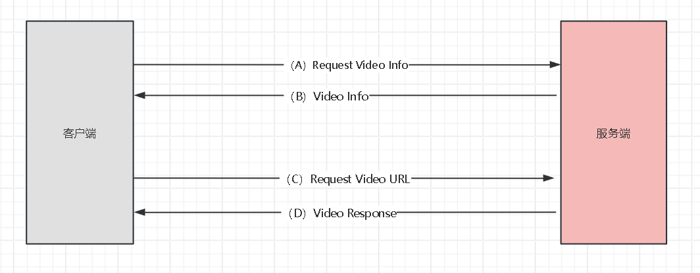

## 1.1.0 (时间还未知)

### Features: 

- 实现视频上传功能（分片上传）
- 新增单独的番剧页面，提高网站的可玩性。
- 新增状态码 （PageNotExist、EmptyData、NotExist），其中返回 PageNotExist
会使前端跳转到相应的错误页面。
- 项目可配置相应的运行环境（spring.profiles.active），在 web.xml 中配置，支持
dev（开发环境）和 prod（生产环境）两种环境。

### Functions:

1. 新增单独的番剧页面，它的功能目前如下：

根据上面列出的功能可以大概列出以下后端接口。

]

### Request Video Flow Process（请求视频流程）:

解释：\
（A）：客户端从服务端获取视频上传的地址。\
（B）：服务端查询用户上传过的视频。\
（C）：客户端请求视频地址。\
（D）：服务端返回视频响应。

### Bug Fixes:

- 修复了日志无法指定输出位置、无法滚动输出的问题，并且在不同的环\
境下使用不同的日志配置。
- 重构了多个接口，以前的接口出现错误是直接抛出的，现在对部分接口进行了捕获。
- 之前是客户端直接与服务端进行通信的，现在客户端须将请求发送至代理服务器，再由
代理服务器将请求转发至服务端。

### Code Refactoring

- 位于不同的环境下可应用不同的配置，可通过设置 DevConfig 或者 ProdConfig 来实现。

## 1.0.0 (2024-04-05)

《花凋 -- 不一样的世界》网站发布，历经两年半，终于诞生！！！

### Introduction:

~~ <花凋> ~~ 网站于 2022年 开始开发，目标是打造一个能发布文章、能发布视频的
娱乐网站。在这用户能体验到不一样的世界。用心打造的用户界面，丝滑的界面切换。
只为让用户有更好的体验。

### Features:

- 第三方登录（提供 Github、Google 登陆方式）。
- 番剧馆（可自定义界面）
- 消息提醒（包括点赞消息、私信、系统消息即评论消息）
- 个人设置（提供账号的配置）
- 关注与粉丝（保持对兴趣的渴望）
- 文章评论、文章点赞、文章收藏
- 文章发布
- 历史访问记录
- 个人主页

