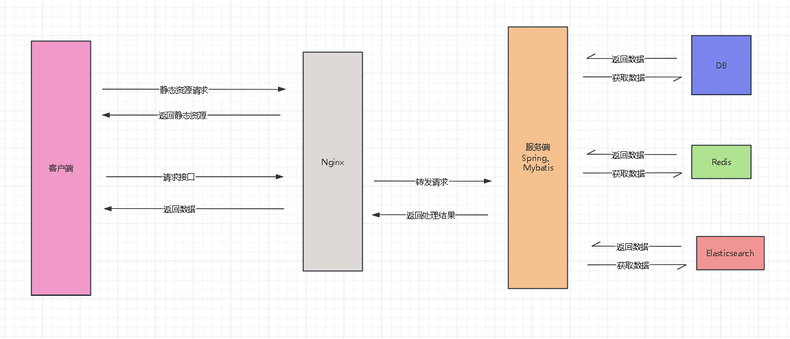

# 1. 项目简介
首先这是一个纯个人开发的个人网站的后端代码库，前端代码库在这
[花凋前端代码库](https://github.com/flower0wine/huadiao-user)。

其次这个项目于 `2022年9月` 开始开发，一直到现在。

## 1.2. 项目功能

该项目的功能很多，下面就列举一些比较有代表性的功能。

- 使用 session 和 cookie 实现用户登录状态的保存。即不用重复登录。
- 使用 redis 生成并保存唯一键，比如每个用户都有一个唯一的 `uid`。
- 使用 elasticsearch 实现搜索功能，例如通过用户昵称来搜索用户。
- 使用原生的 JavaScript 和 spring 的 MultipartFile 实现用户的头像上传功能。
- 使用 WebSocket 和 spring 的 HttpSessionHandshakeInterceptor 和 WebSocketHandler
实现用户之间的私信。目前仅支持相互关注的用户之间进行通信。
- 实现第三方用户登录（Github、Google 登录方式）。

## 1.3. 项目技术栈

- JDK 11 及以上版本
- Spring 5.3.30
- Mybatis 3.5.7
- Elasticsearch 7.16.0
- Redis 5.0.14.1
- Mysql 5.7.19
- Tomcat 9.0.65

## 1.4. 架构



## 1.5. 部署

### 1.5.1. 要求 JDK 11 及以上版本

首先项目使用 Java 开发，需要 `JDK 11` 或以上版本（JDK 11 及 17 亲测可用），
JDK 经验证会造成 Spring 扫描不到 可用的容器，即出现下面的信息提示，并且没有任
何错误，这个问题当时也是困扰我好久，死活 没有怀疑到 JDK 头上，最后也是突然看
到本地与服务器上的 JDK 版本不一样， 想到换个 JDK 版本看看，不然一辈子都解决不了。

```
03-Aug-2024 12:37:24.116 信息 [Catalina-utility-2] org.apache.catalina.core.ApplicationContext.log No Spring WebApplicationInitializers detected on classpath
```

项目刚开始时由于本人并不了解聚合项目的开发流程，也不知道什么是聚合项目，就盲目开始
开发了，到现在甚至想用聚合项目开发，但是项目代码太多，只能持续地堆屎山了。

下面讲讲如何跑起来这个项目，首先在 windows 上，你需要下面好我上面给出的 Tomcat、
JDK、ElasticSearch、Redis、MySQL、Redis 软件。

### 1.5.2. MySQL 配置

然后在 MySQL 中执行项目的 `sql/huadiao.sql` 以创建数据库表。如果你是在服务器
上部署则需要配置 nginx，配置文件在 `other-config/nginx.conf` 当中。

下面是我的 MySQL 配置文件 `my.ini`

```
[client]
port=3306
default-character-set=utf8
[mysqld]
#设置为自己的MYSQL的安装目录
basedir=A:\Download softwares\MYSQL\mysql-5.7.19-winx64
# 设置mysql数据库的数据的存放目录  ---------是你的文件路径data文件夹自行创建
datadir=A:\Download softwares\MYSQL\mysql-5.7.19-winx64\data
port=3306
character_set_server=utf8
#跳过安全检查
skip-grant-tables
```

### 1.5.3. Tomcat 配置

然后项目的静态资源文件在开发环境和生产环境的位置不同，开发环境的静态资源文件位于
`A:/huadiao_images` 目录下，你也可以修改 `dev.properties` 文件来更改静态资
源的保存位置。另外由于开发环境静态资源是从 tomcat 获取的，所以你还需要修改 tomcat 的
配置文件 `conf/server.xml` 来配置静态资源的路径。配置如下：

```xml
<!-- 服务器图片地址 -->
<Context docBase="A:/huadiao_images" path="/images" reloadable="true" />

<!-- 服务器视频地址 -->
<Context docBase="B:/store/video" path="/videos" reloadable="true" />

<!-- 项目路径 -->
<Context path="/huadiao" docBase="A:\Apache Tomcat\apache-tomcat-9.0.65\webapps\huadiao-backend-1.0.0\" reloadable="true" crossContext="true" />
```
